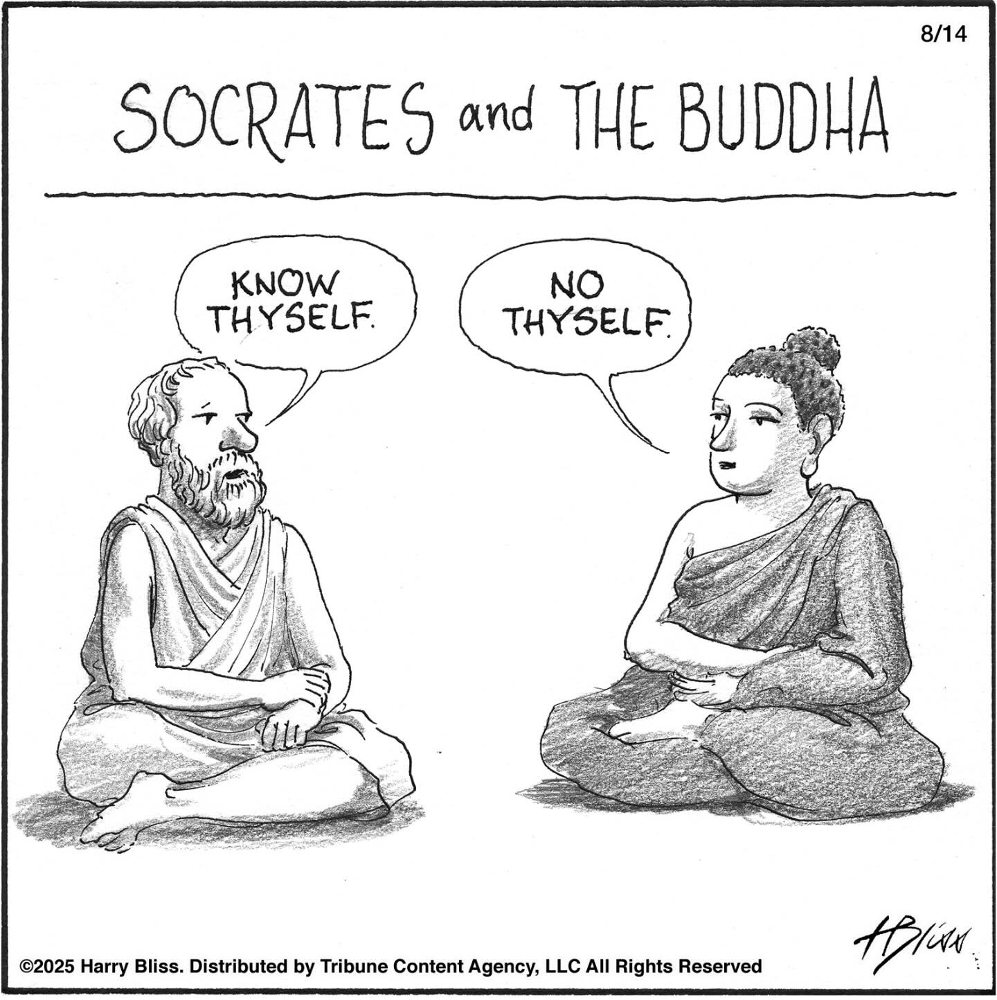

# The Eightfold Path: A Practical Guide
## Week 1, Day 2: Right View - Impermanence and Interdependence

### The Three Marks of Existence

Building on our understanding of the Four Noble Truths, today we explore two fundamental aspects of Right View: impermanence (*anicca*) and interdependence. In Buddhist teaching, these are part of what are called the Three Marks of Existence (the third being *dukkha*, which we explored yesterday).

### Impermanence (Anicca)

The Buddha observed that everything in our experience is in constant flux. Nothing remains unchanged, whether it's our physical bodies, our thoughts and emotions, our relationships, or the world around us. This impermanence isn't just a philosophical concept—it's something we can observe directly:

- Our breath continuously flows in and out
- Emotions arise and pass away
- Thoughts appear and disappear
- Seasons change, days turn to night
- Our bodies age and transform over time

Yet despite this obvious truth, we often live as though things were permanent. We become attached to how things are, or how we want them to be, creating suffering when change inevitably occurs.

### Things Always Becoming Otherwise

In a [conversation](https://dynamic.wakingup.com/pack/PKC4680?source=content%20share&share_id=BF183365&code=SC04C8A7A) with Dan Harris and Sam Harris regarding The Eightfold Path, Joseph Goldstein offers a particularly vivid way to understand impermanence through an unusual English phrase: "things always becoming otherwise." This captures the active, continuous nature of change that the word "impermanence" sometimes misses—recognizing that in every moment, everything is actively becoming something different.

This insight reflects ancient wisdom found across traditions. Persian Sufi poets in the 12th century captured this same truth in the phrase "this too shall pass," telling the story of a king who sought a ring inscription that would make him happy when sad and humble when proud. The simple phrase reminded him that all states, whether joyful or painful—are temporary, flow like water through our hands. What these teachings point to isn't just philosophical abstraction but a practical understanding of how life unfolds moment by moment. You can't step into the same river twice.

Building on this understanding of constant change, Goldstein connects impermanence to a more practical understanding of suffering. Rather than translating dukkha simply as "suffering," he offers: "the inevitability of unwanted experiences." We suffer not because painful things happen, but because we resist the constant "otherwise-ness" of experience.

Consider his simple example: "I can be going for a walk, and then my knee starts to hurt. So now my first thought: 'Oh—becoming otherwise.'" This recognition transforms potential frustration into a reminder of reality's nature. The pain isn't evidence that something has gone wrong—it's just life continuing to unfold as it always does.

The phrase "things always becoming otherwise" interrupts our unconscious expectation of stability. Instead of "This shouldn't be happening," we can recognize "This is how life moves." This shift doesn't eliminate the challenges that change brings, but it removes the additional layer of resistance that multiplies our suffering.

### The Paradox of Impermanence

Impermanence can initially seem like a source of anxiety. If everything is changing, what can we rely on? But the Buddha taught that truly understanding impermanence actually leads to peace, not anxiety. When we stop fighting against the natural flow of change, we can:

- Find freedom from clinging to what cannot last
- Appreciate the preciousness of each moment
- Develop resilience in the face of difficulty
- Recognize that painful states will also pass

### Interdependence

The second aspect of Right View we explore today is interdependence—the understanding that nothing exists in isolation. Everything arises in dependence upon multiple causes and conditions. The Buddha expressed this as "dependent origination" (*paticca-samuppada*).

Consider a simple cup of tea:
- It exists because of the tea plant, water, and heat
- These elements exist because of the sun, rain, soil, and the people who cultivated the plants
- The cup exists because of clay, the potter who formed it, the kiln that fired it
- Your enjoyment of the tea depends on your sense organs, your preferences, your past experiences

This web of interdependence extends infinitely in all directions, connecting us with all life.

### Right View and Identity

When we deeply understand impermanence and interdependence, our sense of self naturally shifts. Rather than seeing ourselves as separate, fixed entities, we begin to recognize ourselves as processes—flowing patterns of experience intimately connected with everything around us.

This doesn't mean we don't exist—clearly, we do! But we exist as rivers rather than rocks, as verbs rather than nouns, as processes rather than things.

### The Self in Buddhist Understanding: Anatta

This cartoon captures a profound philosophical difference that relates directly to one of the Three Marks of Existence we mentioned earlier:

While Socrates's famous dictum "Know thyself" suggests there is a fixed, essential self to discover, the Buddha's teaching points to *anatta* (non-self) - the third mark of existence. This isn't nihilism but an invitation to investigate what we call "self" and discover that it lacks independent, permanent existence.

When we look closely at what we consider to be "me" or "mine," we find only changing processes (physical sensations, emotions, perceptions, mental formations, and consciousness) none of which remain stable or independent. What we call "self" is more like a river than a rock, a flowing process rather than a fixed entity.

This understanding of *anatta* completes the picture of the Three Marks of Existence: impermanence (*anicca*), suffering or unsatisfactoriness (*dukkha*), and non-self (*anatta*). Together, they form the foundation of Right View.

The irony in this cartoon contains deep wisdom: by loosening our grip on a fixed sense of self, we actually come to understand our nature more accurately—as dynamic, interdependent processes rather than isolated entities. This insight naturally leads to greater compassion, as the artificial boundary between "self" and "other" becomes more permeable.

### Practical Reflection

Take a moment to consider:
- What changes have you resisted recently that might be easier to accept with an understanding of impermanence?
- How might recognizing interdependence change how you view a current challenge?
- If you truly accepted impermanence, how might you approach your day differently?

### Today's Practice

Throughout today, notice moments of change—subtle shifts in your body, emotions, thoughts, or environment. When you notice change, gently remind yourself: "This is the nature of all experience." See if this awareness brings a sense of spaciousness or ease."